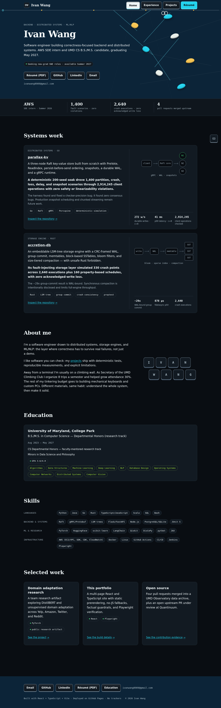

# iwang-1.github.io

**Live at <https://iwang-1.github.io/>**
[](https://github.com/iwang-1/iwang-1.github.io/actions/workflows/deploy.yml)



Ivan Wang's personal recruiting site — a multi-page React + TypeScript + Vite
app ("Chalk & Current" — graphite reading surfaces, deep-water bands, cyan
interactions, a full-bleed climbing route, and keycap-styled controls) deployed
to GitHub Pages at
<https://iwang-1.github.io/> (user site, so Vite `base: '/'`). No router, no
chart libraries, no CDN fonts, no trackers.

## Page map (Vite MPA — `build.rollupOptions.input`)

| Route | Entry | Page module |
| --- | --- | --- |
| `/` | `index.html` | `src/pages/home/main.tsx` — hero, About, Education (`#education`), Skills (`#skills`), Selected work |
| `/experience/` | `experience/index.html` | `src/pages/experience/main.tsx` — center-spine alternating timeline: 4 engineering + 3 community & teaching roles |
| `/projects/` | `projects/index.html` | `src/pages/projects/main.tsx` — DANN, RAG, Professor Predictor, QNLP, open source |
| `/404.html` | `404.html` | `src/pages/not-found/main.tsx` — branded not-found (GitHub Pages serves it natively; `noindex`) |

Each entry hand-writes its own head (title, description, canonical, OG,
JSON-LD). Shared components live in `src/components/`; every fact rendered on
any page lives in one typed module, [`src/content.ts`](src/content.ts), and is
checked against the human checklist in [`FACTS.md`](FACTS.md) by
`scripts/check-facts.mjs` on every build.

## Develop

```bash
npm install
npm run dev        # local dev server (MPA: /, /experience/, /projects/)
npm run check      # fact/framing gate (also runs as prebuild)
npm run build      # tsc -b && vite build && prerender  → dist/ (static #root markup)
npm run verify     # serves dist/ + drives every page in headless Chromium
npm run lint
```

`npm run verify` requires the Playwright Chromium browser
(`npx playwright install chromium` once, if it is not already cached). It
checks every page at 1366x900, 390x844, and 320x700 (head metadata, sticky
route progress, nav active state, internal links, locked facts, a11y gates,
zero console errors) and refreshes the per-page screenshots in `docs/`;
the PNG bytes are not deterministic, so commit them when they change
meaningfully and otherwise `git checkout -- docs` to keep the tree clean.

`public/og.png` is a generated 1200×630 branded card — regenerate with
`node scripts/generate-og.mjs` after brand changes.

The publish script additionally runs a private pre-push scan (kept outside
this repo on purpose) before anything is pushed.

## Deploy

`.github/workflows/deploy.yml` builds and deploys `dist/` to GitHub Pages on
every push to `main` (fact gate → build → `actions/deploy-pages`). The MPA
build needs no workflow changes — the whole `dist/` directory is uploaded,
including `experience/index.html`, `projects/index.html`, and `404.html`
(which GitHub Pages serves natively for unknown paths).
